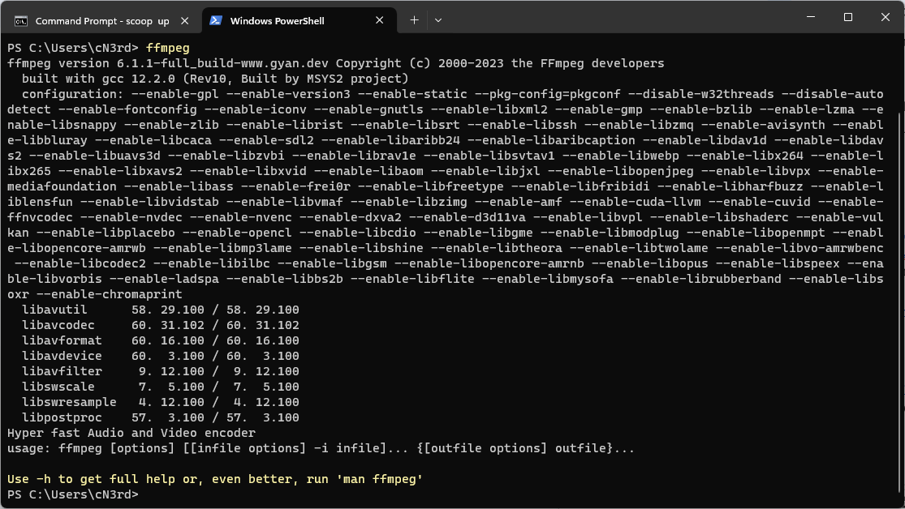
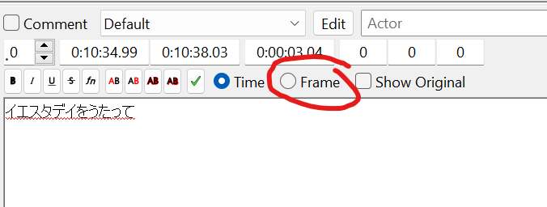
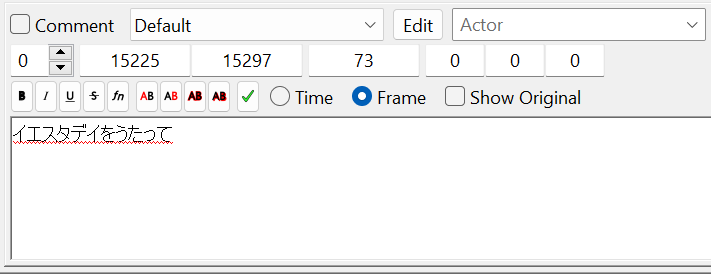
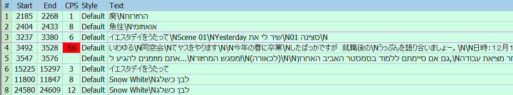

# חיתוך טייפ בפועל

השיטה הכי קלה לחיתוך טייפים כיום
היא בעזרת סקריפט שכתבתי בשם AfterWaltz.

המדריך לעיל מניח שאתם עובדים עם גרסת האגיסאב המומלצת בשרת הפנסאב הישראלי
מידע נוסף תוכלו לראות
[באתר של Good Job! Media](http://goodjobmedia.com/fansubbing/).

## התקנות לפעם הראשונה
- התקינו את AviSynth Plus
[מדף השחרורים הרשמי ב-GitHub](https://github.com/AviSynth/AviSynthPlus/releases).
- הורידו [AvspMod עדכני מ-GitHub](https://github.com/gispos/AvsPmod/releases).

-  הורידו גרסה העדכנית של [L-SMASH מ-GitHub](https://github.com/HomeOfAviSynthPlusEvolution/L-SMASH-Works/releases). \
לכו לתיקיה בה התקנתם את AviSynth
(בדרך כלל `C:\Program Files (x86)\AviSynth+`)
תכנסו שם לתיקיה `plugins64+`,
והעבירו את הקובץ `LSMASHSource.dll` מהתיקייה `x64` לשם.

-  הורידו את הגרסא העדכנית של TypositterMod
[מה-gist בחשבון ה-github של cN3rd](https://gist.github.com/cN3rd/4825bb753680b9e9f67e938f7cd5b4bd)
ע"י לחיצה על הכפתור Download Zip.
העבירו את `typosittermod.avs` לאותה התייקיה.

-  התקינו את [הקודקים של K-Lite מהאתר הרשמי שלהם](https://codecguide.com/download_kl.htm).
מומלץ להוריד את גרסת ה-Mega.
אם אתם רוצים להתקין אך ורק את המינימום ההכרחי,
[ההתקנה של LAV Filters](https://github.com/Nevcairiel/LAVFilters/releases)
מספיקה לצרכי חיתוך ועבודה עם טייפ.

- אם אתם על Windows, התקינו את Scoop בעזרת powershell,

-  אם אתם על Windows, 
פתחו את Powershell כאדמין,
והריצו את שתי הפקודות הבאות כדי
להתקין את scoop על המחשב שלכם:

```powershell
Set-ExecutionPolicy -ExecutionPolicy RemoteSigned -Scope CurrentUser
Invoke-RestMethod -Uri https\://get.scoop.sh | Invoke-Expression
```

- לאחר מכן, פתחו חלון powershell נוסף והריצו את הפקודה הבאה כדי להתקין את ffmpeg על המחשב שלכם:
```powershell
scoop install ffmpeg
```

- ודאו ש-ffmpeg רצה כמו שצריך
על ידי כתיבה של המילה ffmpeg ב-powershell.
זה אמור להיראות כך:



- לכו לתיקיה בה התקנתם את AviSynth (בדרך כלל: `C:\Program Files\Aegisub`) 
והיכנסו לתיקייה `automation/autoload`.
הורידו את הקובץ העדכני ביותר של
[afterwaltz מ-GitHub](https://gist.github.com/cN3rd/b918ea871b5670c5c87f84c9fd187bdf)
(בדומה לאיך שהורדתם את typositter)
והעתיקו אותו לתיקייה.

## הגדרת After Effects

TODO

## תזמון טייפים
תזמנו את הטייפים שלכם כשורות אגיסאב.
מומלץ לעבור למצב תזמון כתוביות באגיסאב,
בעזרת לחיצה על Frames בפאנל בו עורכים את הכתוביות:




במידה ויש לכם קיפריימס, אפשר להיעזר בכלי התזמון הקיימים
כדי להצמיד את הכתובית לקיפריימים של השוט
וללחוץ על `G` כדי להחיל את השינויים.
לחילופין,
לחצו על הוידאו,
נווטו בו בעזרת המקשים השונים,
ותוכלו לראות את הפריים הנוכחי עליו אתם נמצאים
בשורת הסטטוס ישירות מתחת לוידאו:


מומלץ לעשות Play
לכל טייפ בעזרת הכפתור 
ולראות שאין קפיצות או פריימים שהתפספסו.
אם לא תעשו את זה,
יכול להיות שתצטרכו לעבוד על חלק גדול מהטייפ מחדש
כדי לתקן טעויות שלא עליתם עליהן בשלב הזה. 

לאחר שיש לכם שורות מתוזמנות עבור כל הטייפים השונים,
בחרו את כל השורות הרלוונטיות בעזרת לחיצה על `ctrl` לבחירת שורות בודדות או `ctrl+shift` לבחירה של טווח שורות.
כל שורה שבחרתם תהיה בצבע טורקיז, למשל:



אחרי שבחרתם את השורות הרלוונטיות
לחצו על
Automation => After Waltz => Create Typecuts.
זה יגרור פתיחה וסגירה אוטומטית של כמה חלונות
(בהתאם לכמות הטייפ שיש לכם)
ויצור את הקבצים
(בברירת מחדל)
בתת-תיקייה בשם Typecuts
בתייקיה בה הוידאו שלכם נמצא.

**שימו לב:**
אין הבחנה בין טייפים סטטיים לטייפים שאינם סטטיים כרגע.
אנו חותכים וידאו עבור כל טייפ וטייפ שהוא.

## יצירת סקריפט קידוד

AfterWaltz יודעת גם איך ליצור סקריפט קידוד בסיסי.
לחצו על
Automation => After Waltz => Generate Script.
התוכנה תרשום לכם את הנתיב
בו נוצר קובץ ה-AviSynth,
למשל:


אפשר
(ואף מומלץ)
לעבור על הסקריפט
ולשנות ידנית דברים במידת הצורך. 

בברירת מחדל,
הסקריפט יוצר שורות כאלו:

```avisynth
TypositterMod(LWLibavVideoSource("path\to\your\type.avi"),[start_frame],[end_frame])
```

במקרים אלו,
לא משנה אם הטייפ הוא תמונה או סרטון,
כשם ש-LWLibavVideoSource 
יודעת לטפל בשניהם בצורה אוטומטית.

אם נוח לכם,
אפשר לעבוד עם TypositterMod
כמו עם ה-Typositter הרגיל,
כפי שהוא מוצג במדריך של TsUNaMyWaVe.

למשל,
כדי להטמיע טייפ סרטון:
```avisynth
TypositterMod(AVISource("path\to\your\type.avi"),[start_frame],[end_frame])

```
או כדי להטמיע טייפ תמונה:
```avisynth
TypositterMod(ImageSource("path\to\your\type.png",pixel_type="RGB32"),[start_frame],[end_frame])
```
שימו לב כי בעת הטמעת תמונה,
אתם מציינים `pixel_type`
התומך בשכבת alpha.
כמעט תמיד מספיק לרשום `RGB32`.

## ייצוא טייפים מ-After Effects

TODO