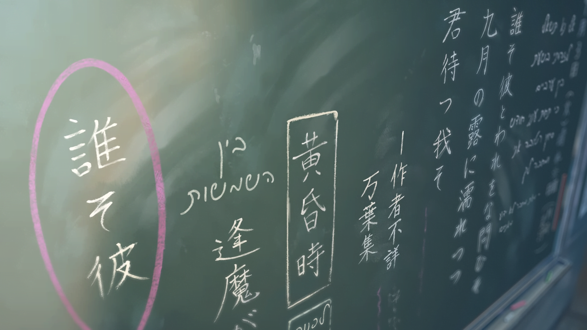
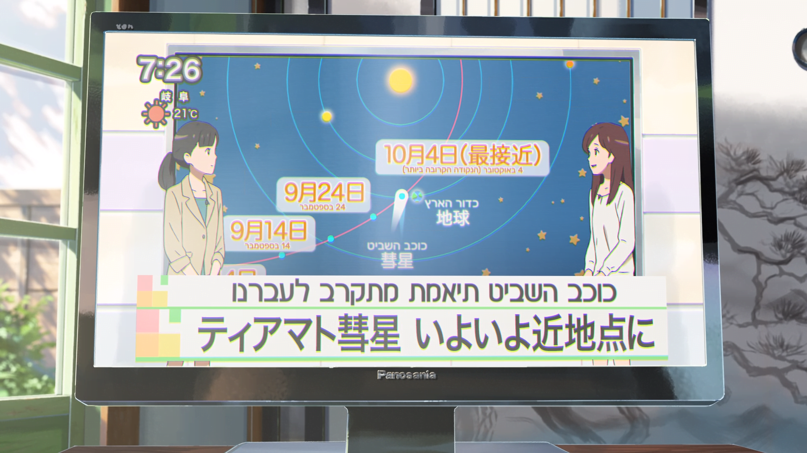

# מבוא לטייפסטינג

## מה זה טייפסטינג
טייפסטינג (באנגלית: typesetting, או "עיצוב דפוס" בעברית)
הוא אמנות ההצגה של חומר טקסטואלי בצורה גרפית,
על נייר או על מדיום אחר
(גם מדיום דיגיטלי).
טייפסטינג הוא חלק משמעותי מעבודת הפנסאב, ובא לידי ביטוי בכמה דרכים שונות:

- עיצוב של טקסט הכתוביות,
כך שהוא יהיה קריא, זורם ומתאים לאופי הסדרה
(נקרא גם Styling).

- תרגום ועיצוב של טקסטים שונים ברקע
(שמות פרקים, מידע על הסצנה\מקום,
או כל אלמנט אחר שחשוב לעלילה ומופיע ברקע).

- תוספות עיצוביות של טקסטים אחרים מיוזמתנו
שנרצה שיופיעו בפרק,
כגון לוגואים, קריוקי, קרדיטים וכו'.

במסגרת מדריך זה נעסוק אך ורק בטייפסטינג של שלטים ולוגואים,
ולא ניגע בעיצוב קריוקי.

חשוב לי להגיד:
בכל הנושא של טייפסטינג יש הרבה מקום ליצירתיות.
אין בדיוק שחור ולבן, נכון ולא נכון.
להפך, יש הרבה מאוד אפור באמצע, ממש כמו בחופש התרגום.
יחד עם זאת, כן צריך לשמור על קוהרנטיות למקור.

## אידיאולוגיית הטייפסטינג שלי

טייפסטינג טוב מוסיף לחוויה של הצופה
מבלי להעיק עליו,
וגורם לו להרגיש שהוא באמת חלק מהסצנה ומסוגל להבין אותה
אע"פ שהוא לא פיזית "שם" ו\או לא יודע יפנית.
במילים אחרות, "לא פחות ולא יותר".
דוגמאות לטייפים כאלו כוללות
כיתוב על לוח בכיתה כלשהי שתורם להבנת המתרחש בפרק,
אפקטים קוליים (SFX),
או מחשבות פנימיות שמיוצגות על ידי טקסטים מונפשים.

*דוגמא לעיצוב דפוס
(השם שלך)*

*דוגמא נוספת לעיצוב דפוס
(השם שלך)*

אפשר להרחיק לכת עם הגישה הזו ולעצב טייפ לכל שלט ושלט בפרק,
אך הדבר יכול לפגוע בקוהרנטיות של הפרק
(אם הפרק מתרחש ביפן, למה כל השלטים בעברית?)
ואף להשפיע על השפיות שלכם
(אתם לא באמת הולכים לעצב 150 שלטים בפרק שבקושי אפשר לשים אליהם לב... נכון?).
לכן, חשוב לשמור על איזון
ולא לרוץ ולעשות טייפ לכל דבר.

## יפנית ועברית
כדי לדבר על טקסט בעברית ויפנית,
חשוב להכיר את סוגי האותיות בשתי השפות האלו
ואיך לבצע הקבלה נכונה ביניהן.

בעברית יש לנו מערכת כתב אחת
המורכבת מ-22 אותיות, ו-6 וריאציות שלהן
(אותיות סופיות).
מערכת הכתב הזו נכתבת בשני סגנונות:
אותיות הדפוס,
שבהן נהוג להשתמש בטקסט דיגיטלי או מודפס,
ואותיות הכתב,
שבהן אנחנו נוהגים לכתוב ביום-יום.
(מבחינה טיפוגרפית, סת"ם או כתב רש"י הם גופנים ולא סגנונות כתיבה).

ביפנית, לעומת זאת, משתמשים בשלוש מערכות כתיבה,
שלכל אחת מהן תפקיד תחבירי שונה.
הסתכלו למשל על המשפט הבא:

    私
    は
    一昨日
    パソコン
    を
    買
    いました。
    Watashi ha, ototoi pasocon wo kaimashita.
    שלשום קניתי מחשב.

- **היראגאנה** (בכתום) -
כתב פונטי המשמש עבור מילים שאין להן קאנג'י,
לצורכי הטיות או תחביר,
או לצורך המחשת ההגייה של קאנג'י (פוריגאנה).
אותיות ההיראגאנה מעוגלות ולא מורכבות ויזואלית.

- **קאטאקאנה** (בירוק-כחול) -
כתב פונטי המיועד לתעתיק של שמות
או מילים לועזיות שאינן מהסינית,
או לשם הדגשת צלילים (SFX).
בניגוד לאותיות ההיראגאנה המעוגלות,
אותיות הקאטאקאנה הן חדות
אך גם פשוטות ויזואלית.

- **קאנג'י** (בכחול) -
סימניות השאולות ברובן מהשפה הסינית[^chinese-japanese]
המהוות את הבסיס לרוב המילים בשפה היפנית.
ביפנית סטנדרטית נהוג להשתמש ב-Joyou Kanji,
סט של 2136 קאנג'י שכל יפני לומד עד סוף חטיבת הביניים.
לרוב קל לזהות את הקאנג'י,
שכן הן מורכבות ויזואלית ביחס להיראגאנה והקאטאקאנה,
אך יש קאנג'י פשוטות יחסית (כמו 一 ו-日)
שאפשר לחשוב שהן קאטאקאנה
(קאנג'י הוא כמעט אף פעם לא מעוגל כמו ההיראגאנה).

שימו לב שיש סייגים לשימושים האלו,
ושלפעמים מערבבים את סגנונות הכתיבה,
בדרך כלל כסוג של אמצעי ספרותי אומנותיים.
זה פחות נפוץ באנימה למיטב ידיעתי.
כמעצבי דפוס,
עלינו לדעת להבחין בין כלל הסגנונות האלו
כדי לקבל החלטות יותר טובות בהמשך.

## טיפוגרפיה עברית
השפה העברית היא שפה ייחודית מבחינה טיפוגרפית.
בעוד האות הלועזית מאופיינת בקווים מאונכים עבים
ובצורות גיאומטריות שונות,
האותיות העבריות מרובעות בבסיסן
ומאופיינות בקווים אופקיים עבים.
נוסף לכך הוא
כיוון הכתיבה השונה והאופי השונה של האות העברית מהווים אתגר בעיצוב טיפוגרפיה דו־לשונית.
נדון בעניין זה בהמשך.

רוב המושגים המוכרים באים מעולם הטיפוגרפיה הלועזית,
וחלק מהמושגים הם עבריים בלבד.
בגלל האופי השונה של מבנה האותיות לא כל המושגים מקבילים.

*אילוסטרציה של סוגי גופנים שונים בעברית*

נבחין בין סוגי הגופנים השונים: ([קרדיט ליקי חסיד מאתר אאא](https://alefalefalef.co.il/%D7%A1%D7%99%D7%95%D7%95%D7%92-%D7%92%D7%95%D7%A4%D7%A0%D7%99%D7%9D/))

- **סריף (serif)**
מתאפיין בסיומות שפיציות של האות (סריפים) ועובי משתנה.
בעברית, הסריפים נובעים מכלי כתיבה קליגרפיים כמו ציפורן,
כתוצאה של משיכה טבעית של היד בכתיבה.
בלעז,
הסריף הוא קישוט שהוסף במקור לאותיות בתקופה הרומית לצרכי חציבה באבן,
ולכן אין התאמה טבעית בין תג עברי לסריף אנגלי. \
מתחלק לשלושה סוגים לפי זמן העיצוב:
    - **ישן** -
    1465 עד אמצע המאה ה-18.
     מתאפיין בהבדלים קטנים בעובי האות.
     (Garamond)
    - **מסורתי** - 
    אמצע המאה ה-18 עד סופה.
    הבדלים גדולים יותר בהפרשי העובי.
    (Times New Roman)
    - **מודרני (דידוט)** - 
    סוף המאה ה-18. הפרשים גדולים מאד בין קווים דקים לעבים.
    קשה לקריאה בטקסט רץ.
    (Bodoni)

- **סנס סריף (sans-serif)** -
גופנים ללא סיומות שפיציות ("סנס" בצרפתית: ללא).
בדרך כלל בעלי עובי אות אחיד.
הגופנים הסנס-סריפיים הראשונים מוכרים מסביבות 1750,
והופיעו בדפוס בסביבות 1800.
שמות נוספים הם Gothic, Grotesk.
גם כאן יש חלוקת משנה:
    - **גרוטסק** -
    הגופנים המוקדמים.
    (Franklin Gothic)
    - **נאו גרוטסק או מסורתי** -
    עיצובים מודרניים יותר בעלי עובי אות אחיד.
    (Helvetica)
    - **הומניסטי** -
    יותר קרובים למסורת הקליגרפית, עם שינויים קלים בעובי האות.
    יותר קריאים.
    (Frutiger)
    - **גאומטרי** - מבוסס על צורות גיאומטריות. קשים לקריאה בטקסט רץ.
    (Century Gothic)

- **סלאב סריף (Slab Serif)** -
גופנים המתאפיינים בסריפים בעלי עובי זהה לעובי האות. האות עצמה בדרך כלל בעלת עובי אחיד. גופנים אלה לפעמים מסווגים כסנס סריף. לפעמים מעוצבים עם רווח קבוע לכל האותיות (Monospace), בדומה למכונת כתיבה. הם מופיעים לראשונה בסביבות 1800.
ישנם שני תתי סגנונות של סלאב:
    - **רהוט (Script)** - גופנים המבוססים על כתב יד רהוט, בניגוד לכתב המרובע. כתיבה של יומיום. לא מקובל לעבודה בטקסט רץ. יש הבדל גדול בין הרהוט העברי ללועזי באופי הכתיבה.
    - **קליגרפי (Antiqua)** - גופנים הדומים לכתב יד מסורתי בציפורן או קולמוס. משמשים יותר לדברים מיוחדים ולא לטקסט רץ. יכולים להכלל גם בקטגוריית גופן סריפי. ([Antiqua](https://en.wikipedia.org/wiki/Antiqua_(typeface_class)))

- **כל השאר** - גופנים המעוצבים בעיקר למטרות צורניות נקודתיות או כחיקוי לכתבים בשפה אחרת. אינם מתאימים לקריאת טקסטים ארוכים, אלא לראווה (כותרות, פוסטרים, אנערף).

לאנשי טיפוגרפיה יותר נוח להתייחס לגופנים לפי השימוש בהם.
בטייפסטינג הדבר פחות מתאים,
כי קטגוריות השימוש שלנו שונות ומכילות ניואנסים אחרים.
אפשר לקרוא על החלוקה הזו עוד באתר שציינתי לעיל.

<!---
אולי שווה להכניס לפה אילוסטרציה של הגופנים לעיל
וגם גופנים דומים בעברית
אילוסטרציית SVG יכולה ממש להתאים
-->

## טיפוגרפיה יפנית

TODO

## התאמת פונטים

TODO

[^chinese-japanese]: *היפנית בכלל והכתב היפני בכלל שאוב מהסינית.
מילים סיניות שאין להם תחליף יפני יכתבו באותיות הסיניות המתאימות להן
ויאמרו בהגייה יפנית.*
